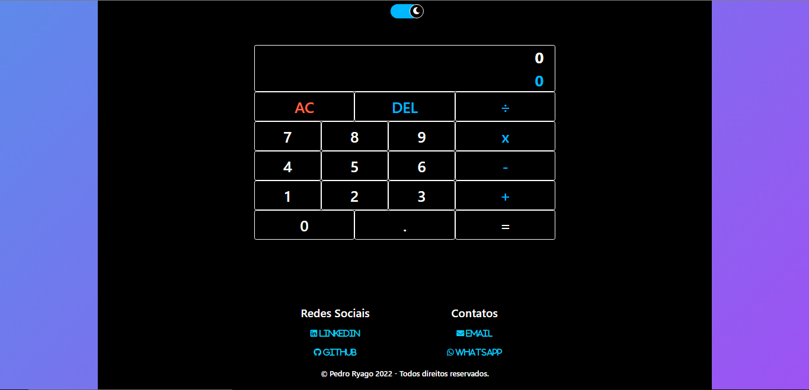
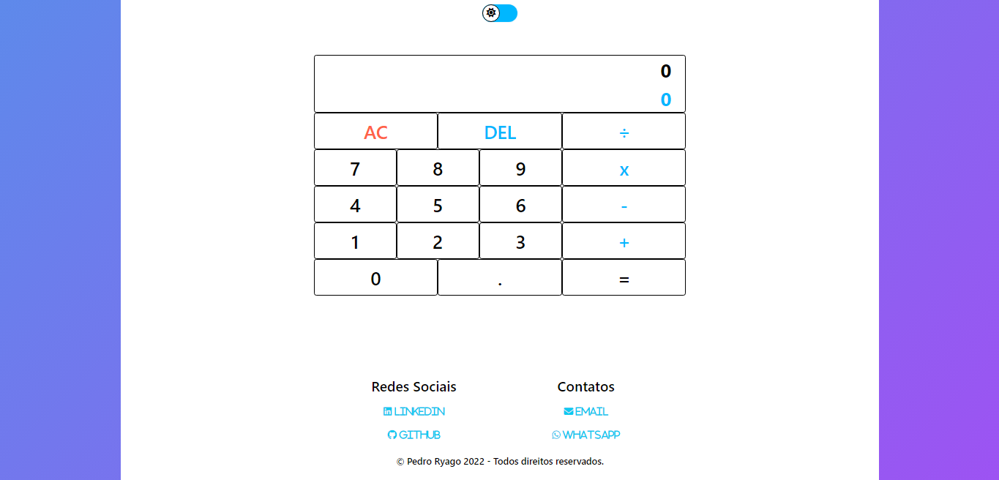

# Calculator
Calculadora criada usando HTML, CSS e JS + Framework Bootstrap.

<h1>Link: <a href="https://pedroryago.github.io/Calculator/" target="_blank">https://pedroryago.github.io/Calculator/</a></h1>

<h1>Dark Theme:</h1> 

  </img>

<h1>Light Theme:</h1> 

  </img>

